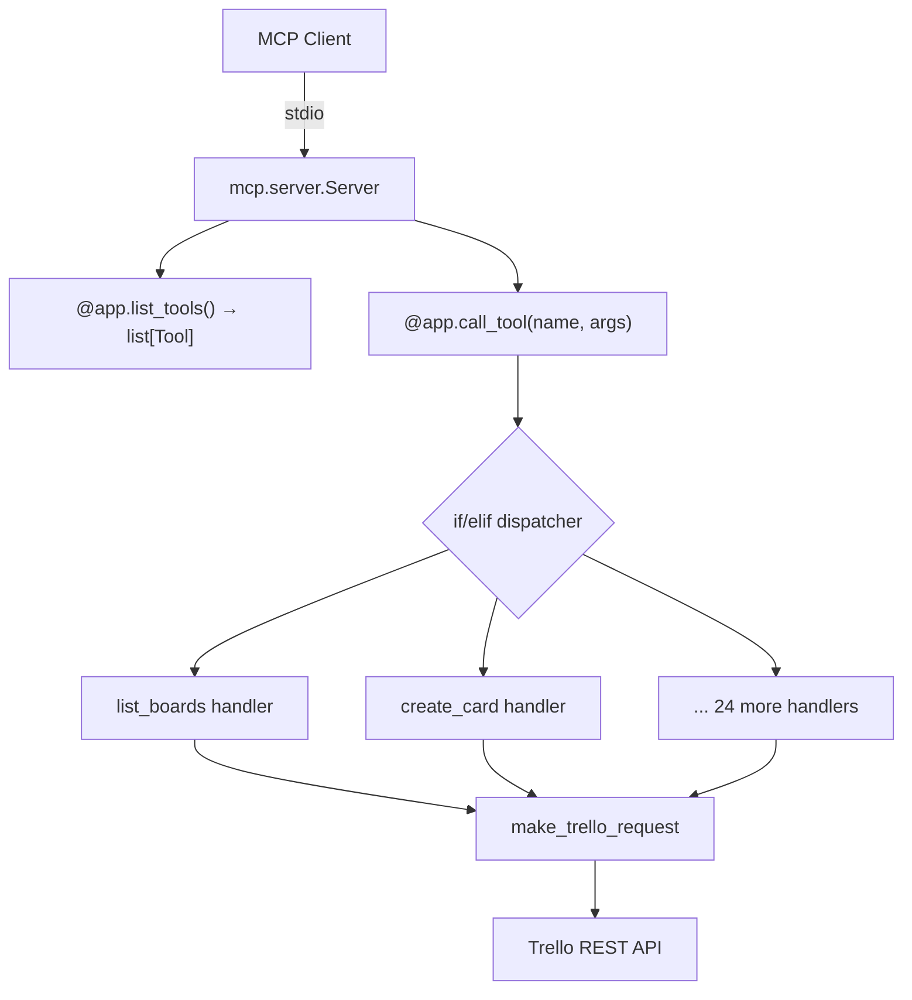
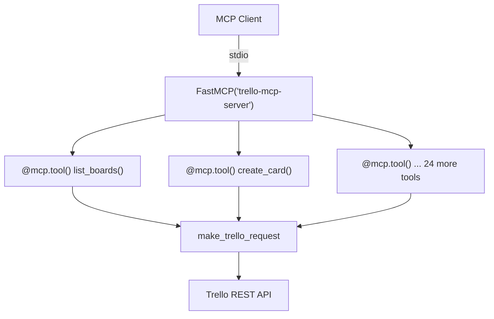
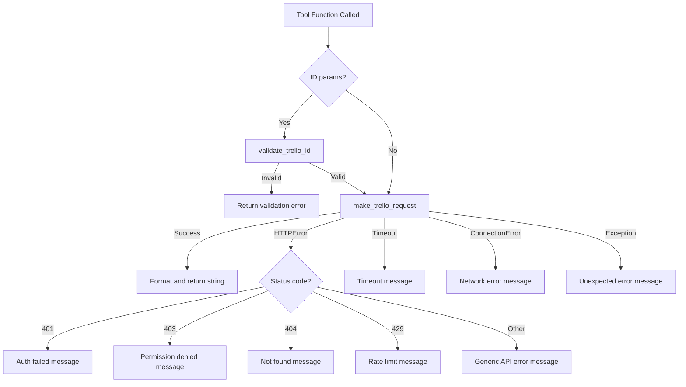

# Design Document: FastMCP Migration

## Overview

This design describes the migration of the Trello MCP server from the low-level MCP SDK pattern (`mcp.server.Server` with `@app.list_tools()` / `@app.call_tool()`) to FastMCP's decorator-based approach (`@mcp.tool()` on individual functions). The migration is a structural refactor of `server.py` — the core logic (API calls, auth, error handling, response formatting) remains identical, but the tool registration and dispatch mechanism changes fundamentally.

The current implementation uses a monolithic architecture:
1. A single `list_tools()` function returning 26 `Tool` objects with hand-written `inputSchema` dicts
2. A single `call_tool()` dispatcher with a ~450-line if/elif chain routing by tool name

FastMCP replaces both with individual `@mcp.tool()` decorated async functions where parameters are declared via Python type hints and FastMCP auto-generates the JSON schemas.

### Key Design Decisions

- **In-place migration**: `server.py` is modified directly rather than creating a new file. The module's public API (`TrelloAuth`, `make_trello_request`, `validate_trello_id`, `TOKEN_CACHE_FILE`, `logger`, `main`, `run`) remains unchanged.
- **Return type change**: FastMCP tool functions return `str` directly instead of `list[TextContent]`. FastMCP wraps the return value automatically.
- **Error handling via decorator**: Each tool function contains its own try/except block (extracted from the monolithic dispatcher) so error messages remain identical.
- **No new dependencies**: FastMCP ships inside `mcp>=1.26.0`, which is already the declared dependency.

## Architecture

### Current Architecture



### Target Architecture



### Migration Scope

| Component | Changes |
|---|---|
| `FastMCP` initialization | Replace `Server("trello-mcp-server")` with `FastMCP("trello-mcp-server")` |
| `list_tools()` | Remove entirely — FastMCP auto-discovers decorated functions |
| `call_tool()` | Remove entirely — FastMCP routes directly to decorated functions |
| 26 tool handlers | Extract from if/elif into individual `@mcp.tool()` async functions |
| `main()` | Replace manual stdio stream setup with `mcp.run(transport="stdio")` |
| `TrelloAuth` | No changes |
| `OAuthCallbackHandler` | No changes |
| `make_trello_request()` | No changes |
| `validate_trello_id()` | No changes |
| `auth.py` imports | No changes (imports `TrelloAuth`, `TOKEN_CACHE_FILE`, `logger`) |
| `__main__.py` | No changes |
| `pyproject.toml` | No changes (already declares `mcp>=1.26.0`) |

## Components and Interfaces

### 1. Server Initialization

**Before:**
```python
from mcp.server import Server
app = Server("trello-mcp-server")
```

**After:**
```python
from mcp.server.fastmcp import FastMCP
mcp = FastMCP("trello-mcp-server")
```

The variable name changes from `app` to `mcp` to follow FastMCP conventions and avoid confusion with the `mcp` package import. Since `auth.py` does not import `app`, this rename is safe.

### 2. Tool Function Pattern

Each tool becomes a standalone decorated function. FastMCP infers the JSON schema from the function signature and docstring.

**Before (one of 26 branches in call_tool):**
```python
# In list_tools():
Tool(name="create_card", description="Create a new card on a list",
     inputSchema={"type": "object", "properties": {...}, "required": [...]})

# In call_tool():
elif name == "create_card":
    data = {"idList": arguments["list_id"], "name": arguments["name"]}
    if "desc" in arguments:
        data["desc"] = arguments["desc"]
    card = make_trello_request("POST", "/cards", data=data)
    return [TextContent(type="text", text=f"Created card: {card['name']}\n...")]
```

**After:**
```python
@mcp.tool()
async def create_card(list_id: str, name: str, desc: Optional[str] = None) -> str:
    """Create a new card on a list."""
    data = {"idList": list_id, "name": name}
    if desc is not None:
        data["desc"] = desc
    card = make_trello_request("POST", "/cards", data=data)
    return f"Created card: {card['name']}\nID: {card['id']}\nURL: {card['url']}"
```

Key differences:
- Parameters are typed function arguments (required params are non-optional, optional params use `Optional[T] = None`)
- Return type is `str` instead of `list[TextContent]`
- Description comes from the docstring
- ID validation moves into each tool function (or a shared helper)

### 3. Error Handling Pattern

Each tool function wraps its body in the same try/except structure currently in `call_tool()`. A shared helper function `_handle_tool_errors` is used as a decorator or context manager to avoid duplicating the error handling across 26 functions.

```python
def handle_request_errors(func):
    """Decorator that wraps tool functions with standard Trello API error handling."""
    @functools.wraps(func)
    async def wrapper(*args, **kwargs):
        try:
            return await func(*args, **kwargs)
        except requests.exceptions.HTTPError as e:
            status_code = e.response.status_code if hasattr(e, 'response') else 'unknown'
            # ... same status-code-specific messages as current implementation
        except requests.exceptions.Timeout:
            return "Error: Request timed out. Please try again."
        except requests.exceptions.ConnectionError:
            return "Error: Cannot connect to Trello API. Please check your network."
        except Exception as e:
            logger.error(f"Error: {e}")
            return "Error: An unexpected error occurred. Please try again."
    return wrapper
```

Each tool is then:
```python
@mcp.tool()
@handle_request_errors
async def list_boards() -> str:
    ...
```

### 4. ID Validation

The current `call_tool()` validates IDs at the top before dispatching. In the new pattern, each tool function that accepts ID parameters calls `validate_trello_id()` at the start of its body. To keep this DRY, the validation is integrated into the error handling decorator (catching `ValueError` from `validate_trello_id`).

### 5. Server Startup (`main()` and `run()`)

**Before:**
```python
async def main():
    # ... auth checks ...
    async with mcp.server.stdio.stdio_server() as (read_stream, write_stream):
        await app.run(read_stream, write_stream, app.create_initialization_options())

def run():
    import asyncio
    asyncio.run(main())
```

**After:**
```python
async def main():
    # ... auth checks (identical) ...
    await mcp.run_async(transport="stdio")

def run():
    import asyncio
    asyncio.run(main())
```

The `run()` function signature is preserved so `pyproject.toml`'s `[project.scripts]` entry (`trello-mcp-server = "server:run"`) continues to work.

### 6. Module Exports

The following symbols must remain importable from `server.py` for `auth.py` compatibility:
- `TrelloAuth` (class)
- `TOKEN_CACHE_FILE` (constant)
- `logger` (logging instance)

These are unchanged by the migration.

## Data Models

### Tool Parameter Mapping

All 26 tools map from the current `inputSchema` dictionaries to typed function signatures. The table below shows the parameter mapping:

| Tool | Required Params | Optional Params |
|---|---|---|
| `list_boards` | *(none)* | *(none)* |
| `get_board` | `board_id: str` | |
| `list_board_lists` | `board_id: str` | |
| `list_board_cards` | `board_id: str` | |
| `create_card` | `list_id: str, name: str` | `desc: Optional[str] = None` |
| `update_card` | `card_id: str` | `name: Optional[str] = None, desc: Optional[str] = None, list_id: Optional[str] = None` |
| `get_card` | `card_id: str` | |
| `create_list` | `board_id: str, name: str` | `pos: Optional[str] = None` |
| `list_organizations` | *(none)* | *(none)* |
| `get_organization` | `org_id: str` | |
| `list_organization_boards` | `org_id: str` | |
| `list_organization_members` | `org_id: str` | |
| `add_organization_member` | `org_id: str, email: str` | `full_name: Optional[str] = None, type: Optional[str] = None` |
| `remove_organization_member` | `org_id: str, member_id: str` | |
| `add_card_label` | `card_id: str, label_id: str` | |
| `remove_card_label` | `card_id: str, label_id: str` | |
| `list_card_labels` | `card_id: str` | |
| `list_board_labels` | `board_id: str` | |
| `filter_cards_by_label` | `board_id: str, label_id: str` | |
| `list_board_members` | `board_id: str` | |
| `add_board_member` | `board_id: str, member_id: str` | `type: Optional[str] = None` |
| `remove_board_member` | `board_id: str, member_id: str` | |
| `update_board_member` | `board_id: str, member_id: str, type: str` | |
| `invite_board_member` | `board_id: str, email: str` | `type: Optional[str] = None` |
| `add_card_member` | `card_id: str, member_id: str` | |
| `remove_card_member` | `card_id: str, member_id: str` | |
| `list_card_members` | `card_id: str` | |

### Return Type Change

| Aspect | Before | After |
|---|---|---|
| Return type | `list[TextContent]` | `str` |
| Wrapping | `[TextContent(type="text", text=...)]` | Raw string |
| Error returns | `[TextContent(type="text", text="Error: ...")]` | `"Error: ..."` |

FastMCP automatically wraps the returned string into the appropriate MCP response format.


## Correctness Properties

*A property is a characteristic or behavior that should hold true across all valid executions of a system — essentially, a formal statement about what the system should do. Properties serve as the bridge between human-readable specifications and machine-verifiable correctness guarantees.*

### Property 1: Schema Equivalence

*For any* tool in the migrated server, the FastMCP auto-generated input schema (property names, required list, and types) should be equivalent to the original hand-written `inputSchema` from the `list_tools()` implementation.

**Validates: Requirements 2.2, 3.1, 3.2, 3.3**

### Property 2: Output Format Equivalence

*For any* tool and *for any* valid mocked Trello API response, the string returned by the new `@mcp.tool()` decorated function should be identical to the text content returned by the old `call_tool()` dispatcher for the same tool name and arguments.

**Validates: Requirements 4.1**

### Property 3: Optional Field Passthrough

*For any* subset of optional fields provided to `update_card` (name, desc, list_id), only the provided fields should appear in the data dictionary sent to `make_trello_request`, and omitted fields should not be present.

**Validates: Requirements 4.4**

### Property 4: Label Filtering Correctness

*For any* list of cards with random label assignments and *for any* target label ID, calling `filter_cards_by_label` should return exactly the cards whose `idLabels` array contains the target label ID, and no others.

**Validates: Requirements 4.5**

### Property 5: Invalid ID Rejection

*For any* string that does not match the Trello ID validation pattern (empty, contains special characters, exceeds 64 characters), passing it as an ID parameter to any tool should return a validation error string without making any Trello API call.

**Validates: Requirements 5.8**

## Error Handling

### Error Handling Strategy

The error handling decorator `handle_request_errors` centralizes all exception-to-message mapping. Each tool function is wrapped with this decorator, preserving identical error messages.

### Error Mapping Table

| Exception / Status Code | Error Message |
|---|---|
| `HTTPError` 401 | `"Error: Authentication failed. Please check your credentials."` |
| `HTTPError` 403 | `"Error: Permission denied. You don't have access to this resource."` |
| `HTTPError` 404 | `"Error: Resource not found. Please check the ID."` |
| `HTTPError` 429 | `"Error: Rate limit exceeded. Please try again later."` |
| `HTTPError` other | `"Error: API request failed (status {code})."` |
| `requests.exceptions.Timeout` | `"Error: Request timed out. Please try again."` |
| `requests.exceptions.ConnectionError` | `"Error: Cannot connect to Trello API. Please check your network."` |
| `ValueError` (ID validation) | `"Validation Error: {details}"` |
| `Exception` (catch-all) | `"Error: An unexpected error occurred. Please try again."` |

### Error Handling Flow



## Testing Strategy

### Approach

The migration is a structural refactor with no new business logic. Testing focuses on verifying behavioral equivalence between the old and new implementations.

### Unit Tests (Example-Based)

Unit tests cover specific scenarios and the error handling matrix:

- **Tool registration**: Verify all 26 tools are registered with correct names
- **Server initialization**: Verify FastMCP instance with correct server name
- **Error message mapping**: One test per HTTP status code (401, 403, 404, 429) and exception type (Timeout, ConnectionError, generic Exception) — 7 tests total
- **Import compatibility**: Verify `auth.py` can import `TrelloAuth`, `TOKEN_CACHE_FILE`, `logger` from `server`
- **Entry point**: Verify `run()` function exists and is callable
- **Specific tool outputs**: Spot-check 3-4 representative tools (list_boards, create_card, update_card, filter_cards_by_label) with mocked API responses

### Property-Based Tests

Property-based tests verify universal properties across all tools using `hypothesis` (Python PBT library).

Configuration:
- Minimum 100 iterations per property test
- Each test tagged with: `# Feature: fastmcp-migration, Property {N}: {title}`

| Property | What It Tests | Generator Strategy |
|---|---|---|
| Property 1: Schema Equivalence | Auto-generated schemas match originals | Parameterized over all 26 tool names with expected schemas |
| Property 2: Output Format Equivalence | New tool output matches old output | For each tool, generate random valid API response dicts and compare formatted output |
| Property 3: Optional Field Passthrough | Only provided optional fields sent to API | Generate random subsets of {name, desc, list_id} for update_card |
| Property 4: Label Filtering Correctness | Filter returns exactly matching cards | Generate random lists of cards with random label assignments and random target label IDs |
| Property 5: Invalid ID Rejection | Invalid IDs rejected before API call | Generate strings with special characters, empty strings, overly long strings |

### Integration Tests

- **Smoke test**: Start the server process and verify it initializes without errors (mocked auth)
- **MCP protocol test**: Send a `tools/list` request via stdio and verify the response contains all 26 tools with correct schemas

### Test Dependencies

- `pytest` — test runner
- `hypothesis` — property-based testing
- `unittest.mock` / `pytest-mock` — mocking Trello API responses
- No additional production dependencies required
